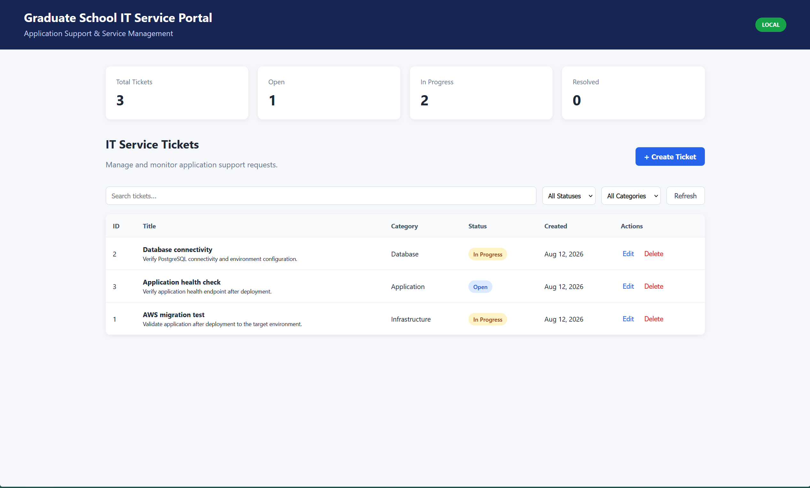

# Grad School Migration & Mitigation Platform

A Java/Spring Boot-based IT operations and application migration platform designed to support the assessment, planning, tracking, validation, and reporting of application transitions from AWS/cloud environments to on-premises infrastructure.

The platform demonstrates enterprise-style Java development, database-backed business workflows, REST APIs, authentication, migration management, operational monitoring, validation, and reporting.

---

## Overview

The Grad School Migration & Mitigation Platform provides a centralized environment for managing application migration and operational workflows.

The platform models a common enterprise IT modernization scenario in which applications and supporting services are transitioned from cloud infrastructure to an on-premises environment.

```text
┌─────────────────────────────┐
│       AWS / Cloud           │
│        Application          │
└──────────────┬──────────────┘
               │
               ▼
┌─────────────────────────────┐
│   Application Assessment    │
│                             │
│ Runtime                     │
│ Database                    │
│ Dependencies                │
│ Infrastructure              │
└──────────────┬──────────────┘
               │
               ▼
┌─────────────────────────────┐
│     Migration Planning      │
│                             │
│ Strategy                    │
│ Priority                    │
│ Risk                        │
│ Downtime                    │
│ Ownership                   │
└──────────────┬──────────────┘
               │
               ▼
┌─────────────────────────────┐
│   Mitigation & Tracking     │
│                             │
│ Issues                      │
│ Dependencies                │
│ Migration Events            │
└──────────────┬──────────────┘
               │
               ▼
┌─────────────────────────────┐
│        Validation           │
│                             │
│ Compatibility Checks        │
│ Configuration Checks        │
│ Dependency Checks           │
└──────────────┬──────────────┘
               │
               ▼
┌─────────────────────────────┐
│      On-Premises System     │
└─────────────────────────────┘
```

---

## Key Features

* Application inventory and management
* AWS-to-on-premises migration workflows
* Application migration readiness assessment
* Migration planning and strategy management
* Risk and priority tracking
* Estimated downtime tracking
* Migration ownership tracking
* Application dependency management
* Migration issue and mitigation tracking
* Application health and status monitoring
* Database-backed operational records
* RESTful APIs
* User authentication and authorization
* Migration validation workflows
* Operational status tracking
* Migration activity logging
* Operational reporting
* PostgreSQL database integration
* Spring Boot enterprise application architecture

---

## Technology Stack

| Category             | Technology             |
| --------------------- | ---------------------- |
| Programming Language | Java                   |
| Backend Framework    | Spring Boot            |
| Security             | Spring Security        |
| Persistence          | JPA / Hibernate        |
| Database             | PostgreSQL             |
| API Architecture     | REST                   |
| Build Tool           | Apache Maven           |
| Application Server   | Embedded Apache Tomcat |
| Frontend             | HTML, CSS, JavaScript  |
| Template Engine      | Thymeleaf              |
| Version Control      | Git / GitHub           |

---

## Architecture

The application follows a layered Spring Boot architecture designed to separate presentation, business logic, and data persistence.

```text
                    ┌──────────────────────┐
                    │      Web Client      │
                    │   HTML / CSS / JS    │
                    └──────────┬───────────┘
                               │
                               ▼
                    ┌──────────────────────┐
                    │     Controllers      │
                    │      REST / MVC       │
                    └──────────┬───────────┘
                               │
                               ▼
                    ┌──────────────────────┐
                    │       Services       │
                    │    Business Logic    │
                    └──────────┬───────────┘
                               │
                               ▼
                    ┌──────────────────────┐
                    │    Repositories      │
                    │    JPA / Hibernate   │
                    └──────────┬───────────┘
                               │
                               ▼
                    ┌──────────────────────┐
                    │      PostgreSQL      │
                    └──────────────────────┘
```

This architecture allows application functionality, business logic, and database operations to be developed and maintained independently.

---

## Application Workflow

The platform follows a structured migration lifecycle.

### 1. Application Inventory

Applications are registered and tracked within the platform.

Application information can include:

* Application name
* Description
* Runtime
* Database technology
* Source environment
* Target environment
* AWS service
* Migration status
* Application dependencies

---

### 2. Migration Assessment

Applications are evaluated to determine their readiness for migration.

The assessment considers technical characteristics such as:

* Runtime compatibility
* Database compatibility
* Target infrastructure
* Application configuration
* Dependencies
* Migration planning status

A readiness score is used to provide a quick overview of the application's migration state.

---

### 3. Migration Planning

Migration plans can be created for individual applications.

Each plan can define:

* Migration strategy
* Priority
* Risk level
* Estimated downtime
* Migration owner
* Implementation notes

The platform supports three migration strategies:

```text
REHOST
   │
   └── Lift and Shift

REPLATFORM
   │
   └── Minor Optimization

REFACTOR
   │
   └── Architectural Changes
```

---

### 4. Dependency Management

Application dependencies are tracked as part of the migration process.

Dependencies can be used to identify infrastructure or application components that must be available in the target environment before migration.

The dependency workflow supports:

* Dependency identification
* Source environment tracking
* Target environment mapping
* Dependency readiness
* Migration status tracking

---

### 5. Migration Validation

The platform provides automated validation checks to identify potential migration issues before cutover.

Validation areas include:

* Runtime compatibility
* Database compatibility
* Target environment
* Dependency readiness
* Migration plan availability
* Application configuration

Validation results are categorized as:

```text
PASS
FAIL
WARNING
```

An overall validation result is calculated from the individual checks.

---

### 6. Migration Activity

Migration activities are recorded as events within the application lifecycle.

Examples include:

* Migration assessments
* Migration plan creation
* Validation execution
* Migration status changes
* Operational events

This provides a historical view of application migration activity.

---

### 7. Reporting

The reporting interface provides a consolidated view of the migration portfolio.

Reports include:

* Total applications
* Average migration readiness
* Migration-ready applications
* Applications requiring review
* Migration strategy distribution
* Risk distribution
* Validation results
* Application readiness
* Recent migration activity

---

## REST API

The application exposes REST endpoints for application and migration operations.

Example endpoint categories include:

```text
/api/applications
/api/applications/{id}
/api/applications/{id}/assess
/api/applications/{id}/plans
/api/applications/{id}/validate
```

These endpoints provide programmatic access to application assessment, migration planning, and validation workflows.

---

## Database

The application uses **PostgreSQL** for persistent data storage.

The database stores information associated with:

* Applications
* Migration plans
* Dependencies
* Migration events
* Validation checks
* Operational status
* Migration activity

JPA/Hibernate provides object-relational mapping between Java entities and PostgreSQL tables.

---

## Security

The platform uses **Spring Security** for application authentication and authorization.

Security is integrated into the application layer to provide protected access to operational functionality and establish a foundation for role-based access control.

---

## Screenshots

Screenshot of the application interface are included below.

### Application Dashboard



The dashboard provides an overview of applications and their current migration status.

---

## Project Structure

```text
Grad-School-Migration-Mitigation-Platform/
│
├── src/
│   ├── main/
│   │   ├── java/
│   │   │   └── ...
│   │   │
│   │   └── resources/
│   │       ├── static/
│   │       ├── templates/
│   │       └── application.properties
│   │
│   └── test/
│
├── pom.xml
├── README.md
├── .gitignore
└── screenshots/
    ├── dashboard.png

```

---

## Requirements

To run the application locally, install:

* Java 21 or compatible JDK
* Apache Maven
* PostgreSQL
* Git

Verify Java:

```bash
java -version
```

Verify Maven:

```bash
mvn -version
```

---

## Running Locally

### 1. Clone the Repository

```bash
git clone https://github.com/toastedjames/Grad-School-Migration-Mitigation-Platform.git
```

Navigate to the project:

```bash
cd Grad-School-Migration-Mitigation-Platform
```

---

### 2. Configure PostgreSQL

Create a PostgreSQL database for the application.

Configure the database connection in the application's local configuration.

Example configuration:

```properties
spring.datasource.url=jdbc:postgresql://localhost:5432/migration_platform
spring.datasource.username=YOUR_USERNAME
spring.datasource.password=YOUR_PASSWORD
```

**Do not commit database credentials or other secrets to the repository.**

For production or shared environments, credentials should be supplied through environment variables or a secure configuration system.

---

### 3. Build the Application

Run:

```bash
mvn clean install
```

---

### 4. Start the Application

Run:

```bash
mvn spring-boot:run
```

The application will start on:

```text
http://localhost:8080
```

---

## Example Workflow

A typical migration workflow using the platform is:

```text
1. Register Application
          ↓
2. Review Application Profile
          ↓
3. Run Migration Assessment
          ↓
4. Review Readiness Score
          ↓
5. Identify Dependencies
          ↓
6. Create Migration Plan
          ↓
7. Define Risk & Downtime
          ↓
8. Execute Validation
          ↓
9. Review Validation Results
          ↓
10. Monitor Migration Activity
          ↓
11. Review Migration Reports
```

---

## Engineering Focus

This project was developed to demonstrate practical experience in:

* Enterprise Java development
* Spring Boot application development
* REST API development
* Relational database integration
* PostgreSQL
* JPA / Hibernate
* Authentication and authorization
* IT business-process automation
* Application migration management
* AWS-to-on-premises migration planning
* Application dependency management
* Infrastructure validation
* Operational monitoring
* Technical reporting
* Database-backed workflows
* Application troubleshooting and maintenance

---

## Design Goals

The platform was designed around several practical IT engineering principles:

### Maintainability

Application components are separated into logical layers to make the system easier to maintain and extend.

### Traceability

Migration activities, validation results, and operational events are persisted to provide visibility into application history.

### Repeatability

Assessment and validation workflows are structured so that they can be executed consistently across applications.

### Operational Visibility

Dashboards and reports provide a centralized view of migration readiness, risks, validation results, and application status.

### Extensibility

The architecture provides a foundation for additional integrations, migration automation, and enterprise services.

---

## Future Improvements

Potential future enhancements include:

* AWS service integration
* Microsoft 365 / Microsoft Graph integration
* Automated migration execution
* Role-based administrative dashboards
* CI/CD integration
* Automated test coverage
* Enhanced audit logging
* Cloud and on-premises environment health comparison
* Integration with enterprise ticketing systems
* Automated notification workflows
* Migration scheduling and approval workflows

---

## Author

**Somak Goswami**

M.S. Electrical Engineering
Virginia Tech

## License

This project is intended as a portfolio and educational project.
